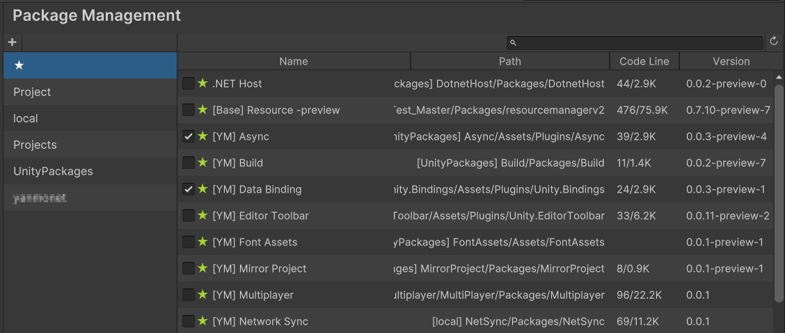
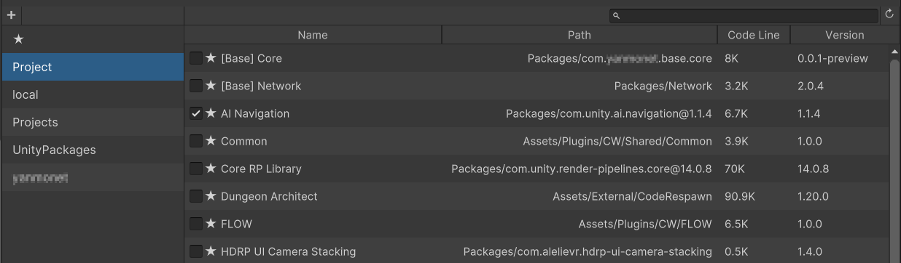
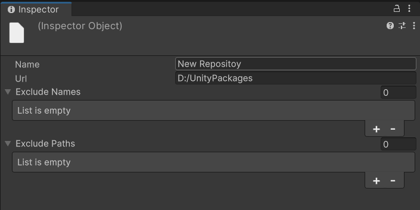
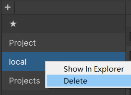
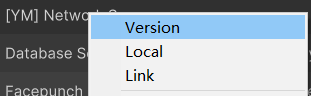
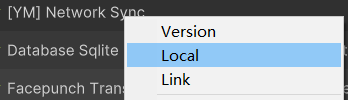
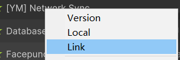
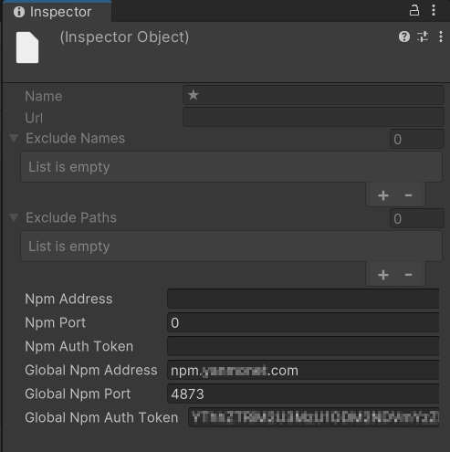
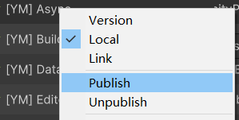

# Unity 包管理器

Unity 包格式为 npm 包

## 包结构

```tex
Package
 ├── package.json
 ├── README.md
 ├── CHANGELOG.md
 ├── LICENSE.md
 ├── Runtime
 │    ├── <Package>.Runtime.asmdef
 │    └── RuntimeExample.cs
 ├── Hotfix
 │    ├── <Package>.Hotfix.asmdef
 │    └── HotfixExample.cs
 ├── Editor
 │    ├── <Package>.Editor.asmdef
 │    └── EditorExample.cs
 ├── Tests
 │    ├── Editor
 │    │    ├── <Package>.Editor.Tests.asmdef
 │    │    └── EditorExampleTest.cs
 │    └── Runtime
 │         ├── <Package>.Tests.asmdef
 │         └── RuntimeExampleTest.cs
 ├── Documentation~
 └── Samples~
      ├── SampleFolder1
      ├── SampleFolder2
      └── ...
```

| 目录/文件      | 描述                                                     |
| -------------- | -------------------------------------------------------- |
| package.json   | 必要文件，包名和版本号等信息                             |
| CHANGELOG.md   | 版本变更说明文档                                         |
| LICENSE.md     | 许可说明                                                 |
| Runtime        | 运行时代码                                               |
| Editor         | 编辑器代码                                               |
| Tests          | 测试代码                                                 |
| Documentation~ | 文档目录                                                 |
| Samples~       | [样例](https://docs.unity3d.com/Manual/cus-samples.html) |

目录结构带 `~` 所有子文件和目录不会生成 `meta` 文件

### [package.json](https://docs.unity3d.com/Manual/upm-manifestPkg.html#unityRelease)

[package.json 编辑面板](https://docs.unity3d.com/Manual/class-PackageManifestImporter.html)

| 属性             | 类型             | 描述                                                         |
| ---------------- | ---------------- | ------------------------------------------------------------ |
| name             | Stirng           | 必要属性，包名，必须唯一，样例 `com.example.`                |
| displayName      | Stirng           | `Package Manager` 窗口显示的名称                             |
| version          | Stirng           | 必要属性，版本号, (1.0.0, 1.0.0-pre-1, 1.0.0-preview-1)      |
| unity            | Stirng           | 要求 unity 的最小版本号，格式 `<MAJOR>.<MINOR>`，样例 `2022.1` |
| keywords         | Array of Strings | `Package Manager` 窗口搜索关键字                             |
| category         | Stirng           | 分类                                                         |
| description      | Stirng           | 描述                                                         |
| dependencies     | Object           | 依赖其它包                                                   |
| author           | Object           | 作者属性 样例 `{ "name" : "Name","email" : "example@mail.com","url" : "http://example.com/"}` |
| documentationUrl | Stirng           | 文档 URL 或提供                                              |
| changelogUrl     | Stirng           | 版本变更文档 URL，等同于 `CHANGELOG.md`                      |
| hideInEditor     | Boolean          | `Package Manager` 窗口是否显示                               |
| license          | String           | OSS许可证标识，符合 [SPDX](https://spdx.org/licenses/) 格式，等同于 LICENSE.md |
| licensesUrl      | String           | 许可证 URL，等同于 LICENSE.md                                |
| samples          | Array of Objects | [样例](https://docs.unity3d.com/Manual/cus-samples.html)，样例：`{"displayName": "<name-to-appear-in-the-UI>","description": "<brief-description>","path": "Samples~/<sample-subfolder>"}` |
| unityRelease     | String           | unity 兼容版本，格式 `<UPDATE><RELEASE>`，样例 `0b4`         |

**package.json 样例**

```json
{
  "name": "com.[company-name].[package-name]",
  "version": "1.2.3",
  "displayName": "Package Example",
  "description": "This is an example package",
  "unity": "2019.1",
  "unityRelease": "0b5",
  "documentationUrl": "https://example.com/",
  "changelogUrl": "https://example.com/changelog.html",
  "licensesUrl": "https://example.com/licensing.html",
  "dependencies": {
    "com.[company-name].some-package": "1.0.0",
    "com.[company-name].other-package": "2.0.0"
 },
 "keywords": [
    "keyword1",
    "keyword2",
    "keyword3"
  ],
  "author": {
    "name": "Unity",
    "email": "unity@example.com",
    "url": "https://www.unity3d.com"
  }
}
```

### 程序集

Unity 包名，key 为 `Unity.Package.Name`

```c#
[assembly: AssemblyMetadata("Unity.Package.Name", "com.example.test")]
```

#### 成员访问

程序集之间访问  `internal` 成员

```c#
[assembly: InternalsVisibleTo("Example.Editor")]
[assembly: InternalsVisibleTo("MyPackage.EditorTests")]
[assembly: InternalsVisibleTo("MyPackage.Tests")]
```


## 包清单

工程包清单位置 `Packages/manifest.json`

### 协议

| 协议      |                                     |
| --------- | ----------------------------------- |
| file      | `file:<PackageFolder>`              |
| https     | `https://example.com/package.git`   |
| git+https | `https://example.com/package`       |
| ssh       | `ssh://git@example.com/package.git` |
| .tgz      | `file:<path>/filename.tgz`          |

### 路径格式

| 路径          | 样例                                                         |
| :------------ | :----------------------------------------------------------- |
| 相对路径      | `file:../PackageFolder`                                      |
| 绝对路径      | `file:/Packages/PackageFolder`                               |
| 绝对路径      | `file:C:/Packages/PackageFolder`                             |
| 默认分支      | `"https://example.com/myrepository.git"`                     |
| 指定分支      | `"https://example.com/myrepository.git#my-branch"`           |
| 指定版本号    | `"https://example.com/myrepository.git#v2.0.0"`              |
| 提交哈希      | `"https://example.com/myrepository.git#9e72f9d5a6a3dadc38d813d8399e1b0e86781a49"` |
| 子目录        | `https://example.com/myrepository.git?path=/subfolder`       |
| 子目录+版本号 | `https://example.com/myrepository.git?path=/subfolder#v1.2.3` |


## 仓库

工程设置界面打开 `Project Settings/Package Management` 包管理器界面



### 仓库列表

#### 收藏仓库

`★` 为收藏列表，高亮色为收藏，否则为未收藏

在 Package 列表点击 `★` 切换收藏状态

#### 项目仓库

`Project` 为当前工程包含的包



### 创建仓库

1. 点击左上角 `✚` 新建菜单
2. 在 `Inspector` 面板编辑仓库信息，Name 为仓库名称，Url为本地目录



3. 点击右上角 `↻` 刷新按钮扫描本地包

### 删除仓库

仓库右键菜单选择 `Delete` 删除仓库




### 包列表

- Name

  包显示名称

- Path

  包本地路径

- CodeLine

  统计的代码行数

- Version

  版本号

## 引用包

- 版本号

  包右键菜单选择 `Version`，包清单生成格式 `"com.example": "0.0.1"`

  

- 本地路径

  包右键菜单选择 `Local`，包清单生成格式 `"com.example": "file:d:/example"`

  

- 软链接

  包右键菜单选择 `Link`，生成 `Packages/Example` 包目录软链接

  

  


## 发布包


### 发布包

1. 安装 [nodejs](https://nodejs.org/en/download) 

2. 配置 npm 服务器, 点击收藏仓库

   

   编辑 `Npm Address`, `Npm Port`, `Npm Auth Token`

   `Npm Address` 保存在当前项目，`Global Npm Address` 保存在本地，所有工程共享

3. 包右键菜单选择 `Publish` 发布包

   

   实际执行 `npm publish` 命令

   ```
   npm publish --registry REGISTRY_URL
   ```

   

### 取消发布包

> 需要npm服务器配置允许取消发布

包右键菜单选择 `Unpublish` 删除发布的包

实际执行 `npm unpublish` 命令

```
npm unpublish <package>@<version>  --registry REGISTRY_URL
```

